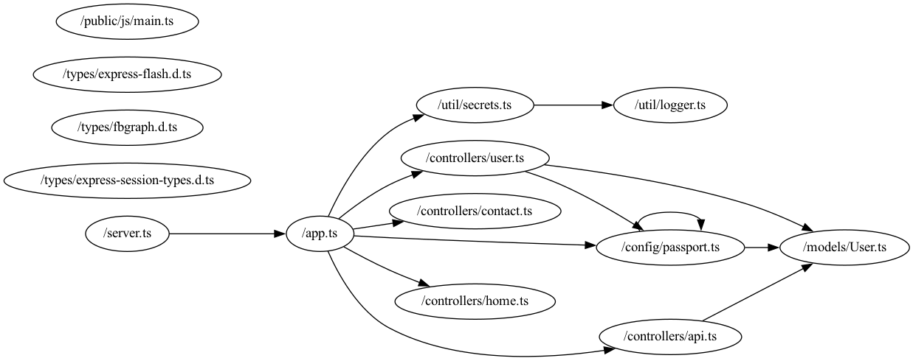

# ES6 Project Analyzer

Analyzes ES6 project imports

Example generated graph from: <https://github.com/microsoft/TypeScript-Node-Starter/tree/master/src>

Generate from dot file:

```bash
dot -Grankdir=LR -Tpng example1.dot -oout.png
```



## Time for generating graph for <https://github.com/nestjs/nest>

```bash
cargo run  0.56s user 0.28s system 83% cpu 1.010 total
```

Output as a [SVG](https://www.figma.com/file/OAyJnZ5Pr0c6jnl5IxQmJd/Untitled?node-id=1%3A2&t=fBY2qmekHhwzRFq9-1)
